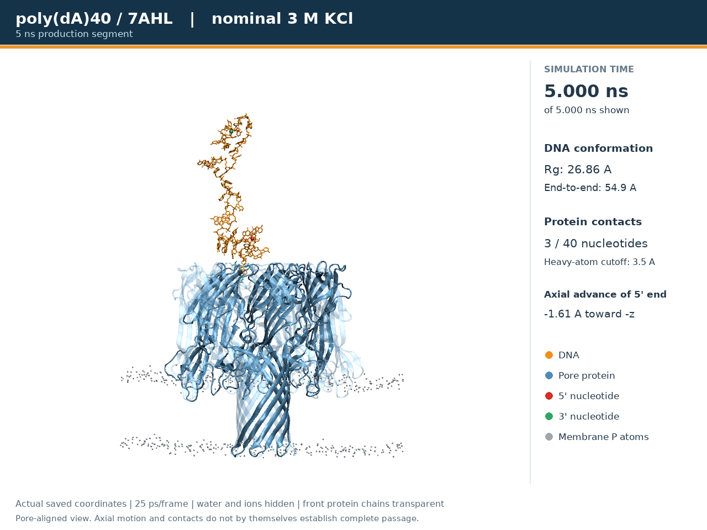
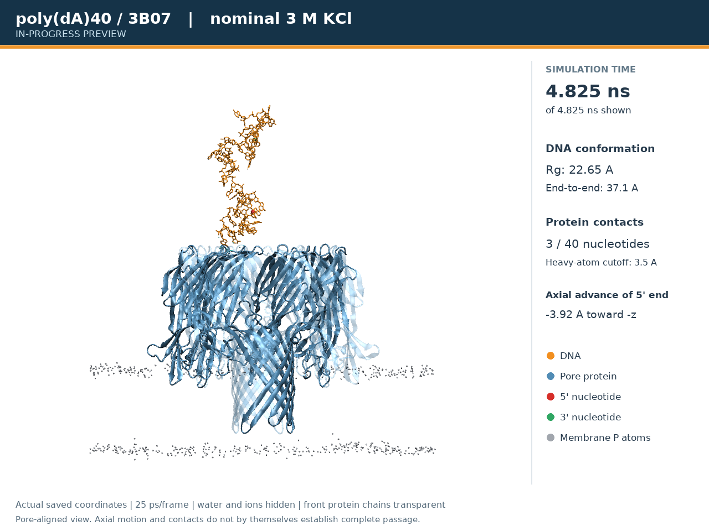

# dA 过孔轨迹：结果与视频

这是实际电场 production 轨迹的分析，不是人为制作的穿孔动画。
两条轨迹目前均未观测到 40 nt DNA 完整通过蛋白孔；观察到的是孔口附近接触与构象变化。
5 ns 模拟段结束不等于完成穿孔。3B07 在导出时仍在运行，发布的是明确标注的预览。

## 视频

| 体系 | 导出范围 | 视频 | 数据 |
|---|---:|---|---|
| dA–7AHL | **0–5.000 ns，完整模拟段** | [MP4](polyda40-3m-kcl-7ahl/trajectory.mp4) | [目录](polyda40-3m-kcl-7ahl/) |
| dA–3B07 | **0–4.825 ns，运行中预览** | [MP4](polyda40-3m-kcl-3b07-preview/trajectory.mp4) | [目录](polyda40-3m-kcl-3b07-preview/) |

GitHub 若不能直接播放，请点击文件页的下载按钮。视频为 1280 × 960、10 fps，
每个实际轨迹帧间隔 25 ps，无坐标插值。0 ns 是 production 输入检查点，其后是 DCD 的 0.025、0.050… ns 帧。

DNA 为橙色，5′/3′端为红色/绿色；蛋白蓝色、前侧亚基透明，膜仅显示磷原子。
水和离子只在画面中隐藏，没有从原模拟删除。所有显示原子共享蛋白对齐的刚体变换，DNA 不被拉直或按期望方向移动。

## 当前结果

| 指标 | dA–7AHL，5.000 ns | dA–3B07，4.825 ns 预览 |
|---|---:|---:|
| 重原子 Rg，起点 → 终点（Å） | 28.81 → 26.86 | 24.55 → 22.65 |
| 两端 C1′ 距离，起点 → 终点（Å） | 62.03 → 54.92 | 47.73 → 37.08 |
| 5′端沿 −Z 的净推进（Å） | −1.61 | −3.92 |
| 平均接触蛋白的核苷酸数，3.5 Å 截断 | 2.59 / 40 | 2.71 / 40 |
| 导出帧中的最小 DNA 自镜像距离（Å） | 97.25 | 123.30 |

负净推进表示终点相对起点沿 +Z 移动，不表示单调运动。
7AHL 的 DNA 质心沿 −Z 净移动约 6.58 Å，但 5′端未相应持续推进，不能把质心移动写成完整穿孔。
两套终点 Rg/端距低于起点，只说明端点构象更紧凑，不能据此宣称已收敛或推算穿孔速率。

较常出现的接触包括 7AHL 的 D:19 THR、C:17 ASN、D:17 ASN，
以及 3B07 预览的 D:39 LYS、D:40 LYS、C:20 TYR。
精确占比在 `protein_contact_occupancy.csv`；这是几何接触，不是结合能或氢键占有率。
两条轨迹时长不等、没有独立重复，不能直接宣称两种孔存在统计显著差异。

## 文件

- `trajectory.mp4`、`poster.png`、`movie_validation.json`：视频、预览及编码/解码校验。
- `timeseries.csv`、`nucleotide_z.csv`、`nucleotide_contacts.csv`、`protein_contact_occupancy.csv`：逐帧指标和残基接触。
- `overview.png/pdf`：轴向位置、Rg、接触数量及逐核苷酸位置图。
- `dna_coordinates.npz`：完整、蛋白对齐后的 DNA 原子坐标与真实时间轴。
- `start.pdb`、`endpoint.pdb`、`visualization.psf`、`visualization.dcd.gz`：轻量显示轨迹。
  **该 PSF 删除了溶剂、部分原子及力场相互作用项，只供可视化，不能用于 MD。**
- `inputs/`：完整体系 PSF/PDB、真实 production 起点 coor/vel/xsc、约束参考及水/离子参数。
- `production.namd`：从归档起点复现生产设置的配置，不会自动提交作业。
- 7AHL 的 `checkpoint/`、`production.log.gz`、`endpoint_validation.json`：完成 5 ns 的终点重启、日志和检查。
  3B07 预览只提供截止对应步数的 `production_energy_excerpt.txt`，没有把不断更新的 restart 冒充预览终点。
- `summary.json`、`archive_manifest.json`、`forcefield_sha256.json`：来源、步数、字节边界和校验和。

完整体系 DCD 约 1.15 GB（7AHL）及至少 1.67 GB（本次 3B07 帧快照），不放入普通 Git。
原始数据仍在集群；`summary.json` 记录其来源和哈希。对增长中的 3B07 DCD，
记录固定完整帧区间的 payload SHA-256，排除会变化的文件头和后续新增帧。

见[本次协议](PROTOCOL.md)、[分析定义与复现](METHODS.md)及[脚本](../../analysis/)。
