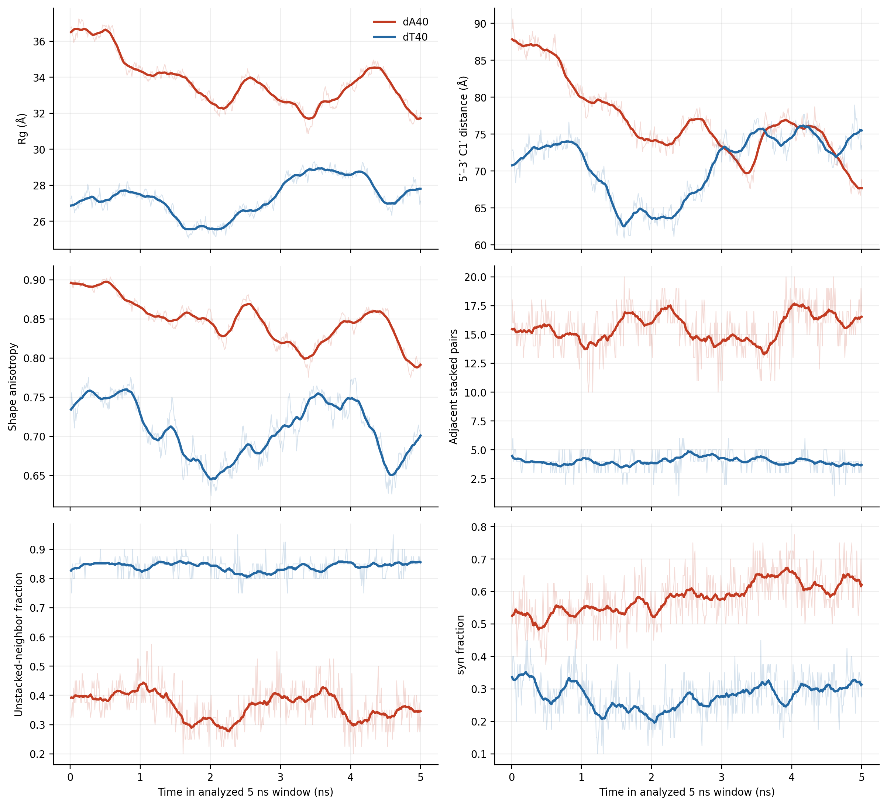
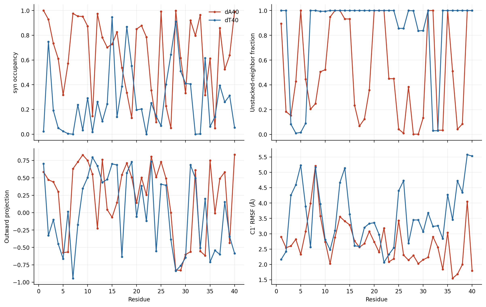
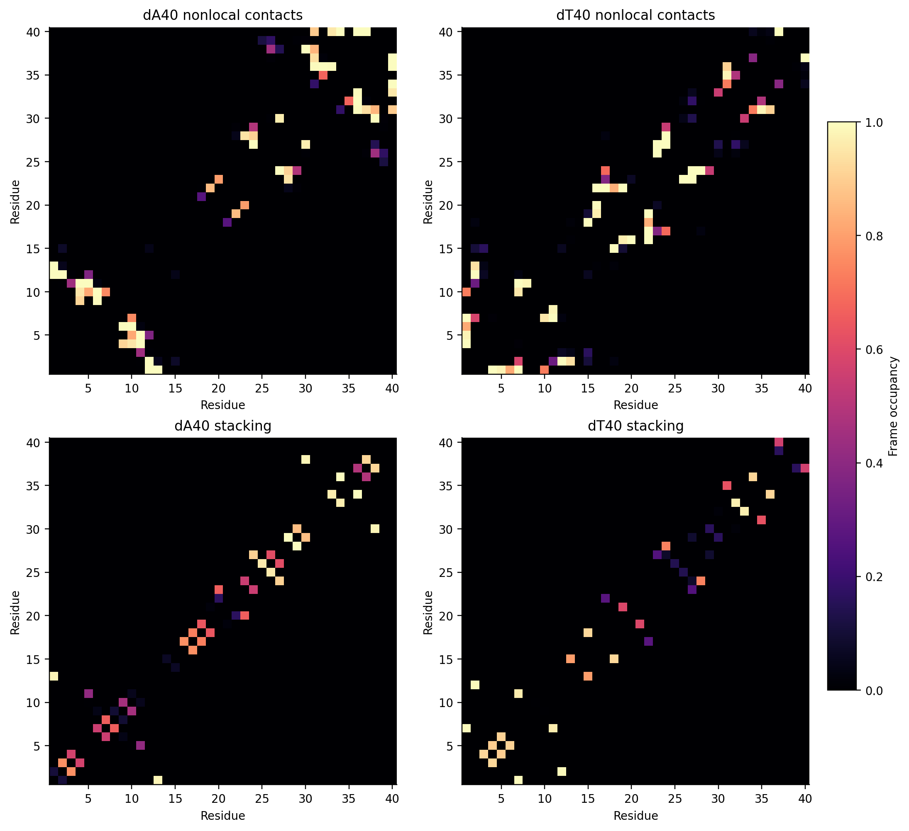
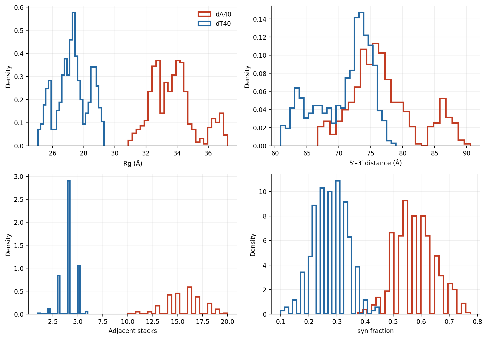
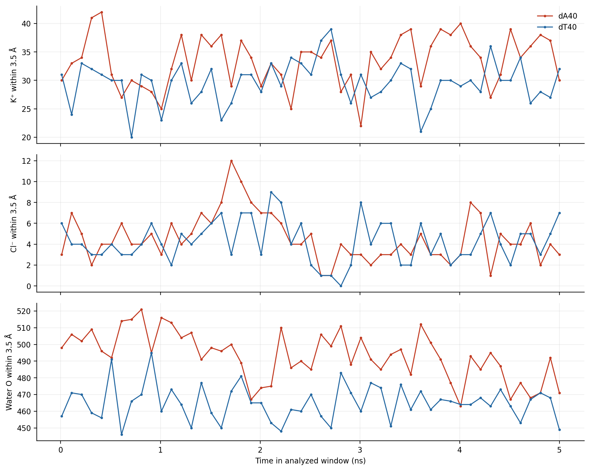
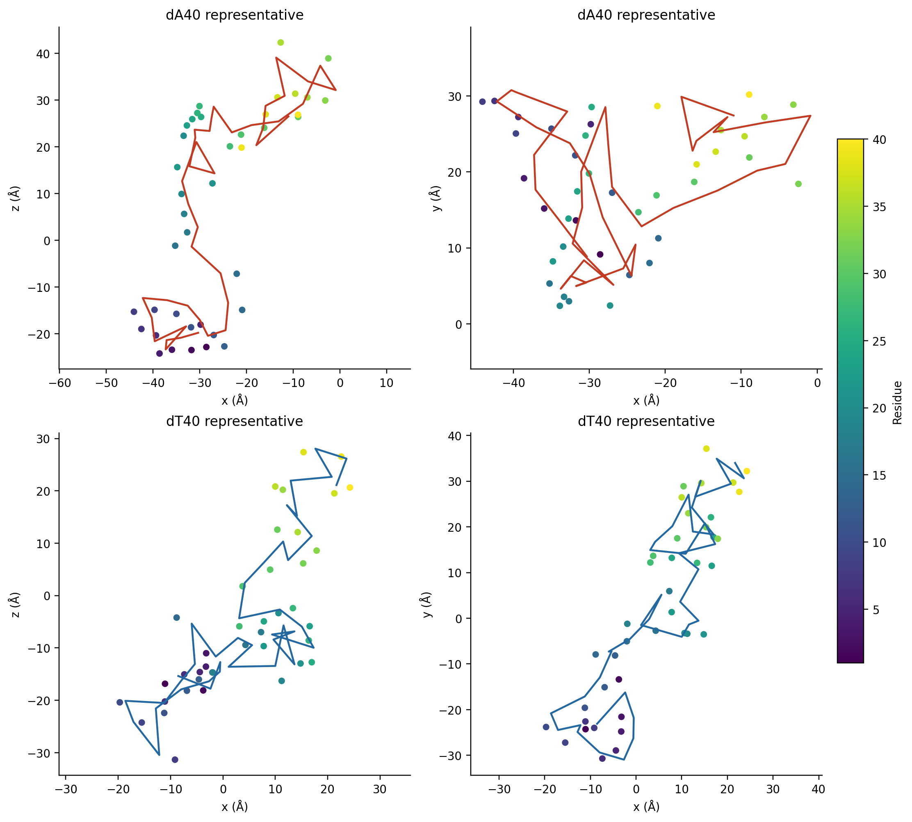

# poly(dA)40/poly(dT)40 structural analysis in 3 M KCl

This directory contains the periodic-image-aware comparison. Coordinates are
reconstructed through PSF covalent bonds before any molecular geometry is measured.

## Compared windows

| Sequence | Trajectory used | Frames | Source time | Window length |
|---|---|---:|---:|---:|
| poly(dA)40 | 5 ns production | 0–499 | 0.01–5.00 ns | 5.00 ns |
| poly(dT)40 | 5 ns production | 0–499 | 0.01–5.00 ns | 5.00 ns |

Both DCDs contain one frame every 10 ps. Both trajectories followed 0.5 ns
heating and 9.5 ns equilibration before production. Exact input hashes and
selected frame indices are in [`validation.json`](validation.json).

## Main result

Values are mean ± frame-to-frame standard deviation over 500 frames. Frames are
autocorrelated, so these standard deviations are descriptive and are not
independent-replica uncertainty estimates.

| Metric | dA40 | dT40 |
|---|---:|---:|
| Radius of gyration, Å | 33.76 ± 1.41 | 27.32 ± 1.05 |
| 5′–3′ C1′ distance, Å | 76.89 ± 5.19 | 70.83 ± 4.38 |
| C1′ contour length, Å | 249.42 ± 2.66 | 293.72 ± 3.12 |
| End-to-end / contour | 0.308 ± 0.022 | 0.241 ± 0.014 |
| Shape anisotropy | 0.848 ± 0.029 | 0.709 ± 0.039 |
| Adjacent stacked pairs | 15.55 ± 1.84 | 4.01 ± 0.75 |
| Unstacked-from-neighbors fraction | 0.364 ± 0.066 | 0.841 ± 0.030 |
| syn fraction | 0.581 ± 0.072 | 0.278 ± 0.062 |
| Mean outward base projection | 0.039 ± 0.079 | 0.004 ± 0.034 |
| Nonlocal residue-contact pairs | 18.49 ± 2.42 | 29.06 ± 2.00 |
| Base–base hydrogen bonds | 3.02 ± 1.12 | 0.78 ± 0.43 |
| All inter-residue hydrogen bonds | 6.49 ± 1.76 | 4.49 ± 1.25 |
| K⁺ within 3.5 Å of DNA | 33.41 ± 4.55 | 29.67 ± 3.76 |
| Water O within 3.5 Å of DNA | 493.25 ± 14.47 | 465.06 ± 10.55 |

The matched early-production windows show different global and local ordering.
dA40 has a 24% larger Rg, a 9% larger end-to-end distance and a 20% higher
shape anisotropy, so it is more rod-like during these 5 ns. dT40 nevertheless
has an 18% longer C1′ contour: its lower end-to-end/contour ratio and larger
number of nonlocal contacts show that this longer contour folds back on itself
more strongly.

The local base organization gives the opposite ordering. dA40 retains nearly
four times as many adjacent stacks, has less than half the
unstacked-from-neighbors fraction and forms more base–base hydrogen bonds.
These directions hold in all ten 0.5 ns blocks, rather than arising from one
brief excursion.

“Base flipping” is not one unique observable. dA40 has much higher syn
occupancy (58.1% versus 27.8%), supporting more frequent base reorientation.
dA residues 1, 6, 8, 25, 28, 33 and 37 have syn occupancy above 0.90;
residues 11, 28 and 33 have mean outward projection above 0.70. The chain-wide
mean outward projection is close to zero for both sequences, so syn occupancy
is the stronger distinction in this matched window and should not be treated
as synonymous with loss of stacking.

Within the first 5 ns, dA40 is already moving toward compaction: its 0.5 ns
block-mean Rg decreases from 36.54 to 32.65 Å and its end-to-end distance from
87.07 to 70.27 Å. The present comparison therefore describes an early
relaxation window, not a converged long-time ensemble.

In the state heat maps, purple is 0 and yellow is 1. In the top row, 1 means
syn; in the bottom row, 1 means no strict stack with either sequence neighbor.

Each figure is also available as a vector PDF:
[`01`](01_global_structure.pdf),
[`02`](02_residue_profiles.pdf),
[`03`](03_base_state_heatmaps.pdf),
[`04`](04_contact_and_stack_maps.pdf),
[`05`](05_distributions.pdf),
[`06`](06_ion_and_hydration_contacts.pdf) and
[`07`](07_representative_structures.pdf).

## Operational definitions

- Rg is mass-weighted over DNA heavy atoms. Shape anisotropy ranges from 0 for
  an isotropic object to 1 for an ideal line.
- End-to-end distance joins residue 1 and 40 C1′ atoms; contour length sums all
  adjacent C1′ distances.
- A strict base stack requires centroid distance ≤5.5 Å, plane-normal alignment
  within 45°, normal separation 2.0–4.5 Å and lateral displacement ≤3.5 Å.
- χ uses O4′–C1′–N9–C4 for adenine and O4′–C1′–N1–C2 for thymine. `|χ| < 90°`
  is classified as syn.
- Outward projection is the dot product of the unit C1′→base-centroid vector
  and the unit molecular-center→C1′ vector. Positive values point outward.
- A nonlocal contact is any heavy-atom distance ≤4.5 Å between residues
  separated by at least three positions.
- Hydrogen bonds use donor–acceptor distance ≤3.5 Å and D–H–A angle ≥150°.
- Ion and water contacts are counted within 3.5 Å of any DNA heavy atom every
  100 ps using periodic nearest-neighbor distances.

The largest reconstructed DNA bond over all analyzed frames is 1.717 Å for
dA40 and 1.704 Å for dT40. The minimum dT40 DNA-to-image distance is 85.886 Å,
so no short-range periodic-image contact occurs.

## Files

- [`summary.csv`](summary.csv): one-row-per-sequence global summary.
- [`timeseries.csv`](timeseries.csv): 1,000 frame records for global metrics.
- [`block_means_0p5ns.csv`](block_means_0p5ns.csv): 0.5 ns block means.
- [`per_residue_summary.csv`](per_residue_summary.csv): 40 residue summaries per sequence.
- [`per_residue_timeseries.csv`](per_residue_timeseries.csv): all 40,000 residue/frame records.
- [`environment_timeseries.csv`](environment_timeseries.csv): ion, water and box concentration data.
- `dA40_*_occupancy.csv`, `dT40_*_occupancy.csv`: 40 × 40 contact, stack and hydrogen-bond occupancies.
- `dA40_representative.pdb`, `dT40_representative.pdb`: real sampled representative frames.
- `01`–`07` `.png` and `.pdf`: raster and vector versions of every plot.
- [`../../scripts/analyze_equal_window.py`](../../scripts/analyze_equal_window.py):
  standalone Python analysis and plotting source.

## Interpretation

The comparison uses matched 0.01–5.00 ns production windows for both
sequences. Each sequence is represented by one trajectory, so the reported
variation describes frames within these early trajectories. Independent
replicas and longer matched sampling would be required to estimate
population-level uncertainty, convergence or free-energy differences.
