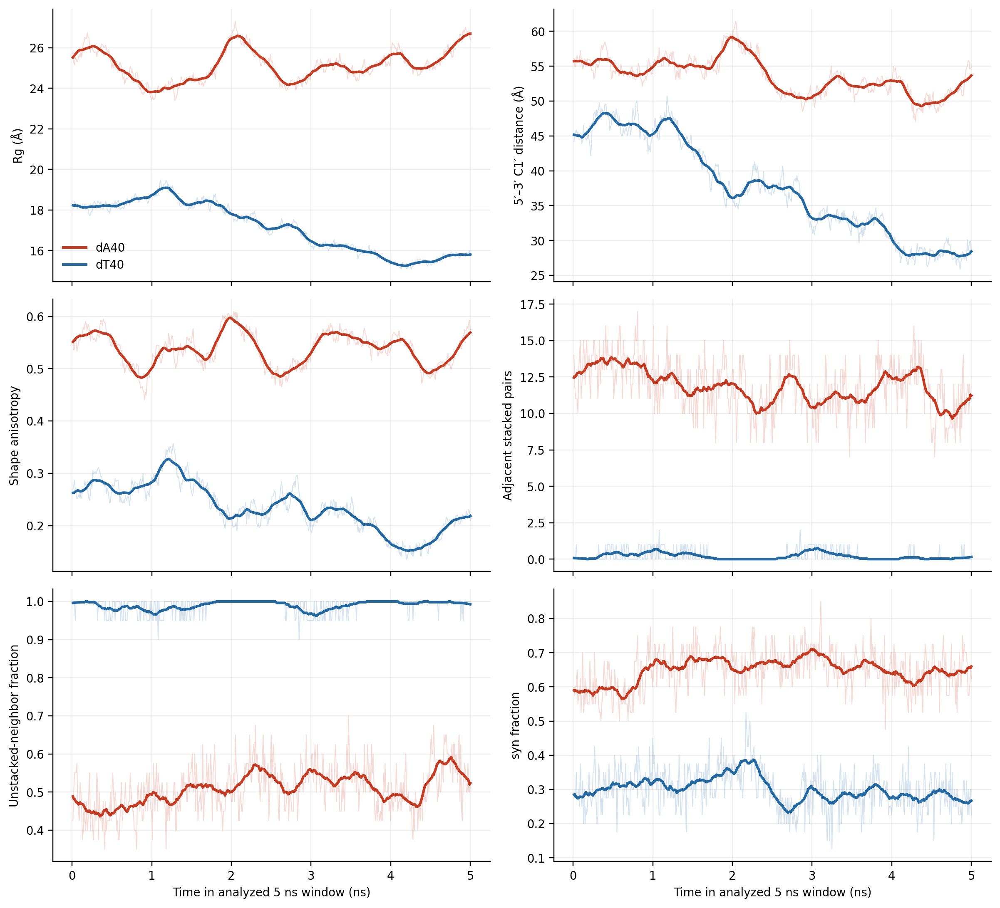
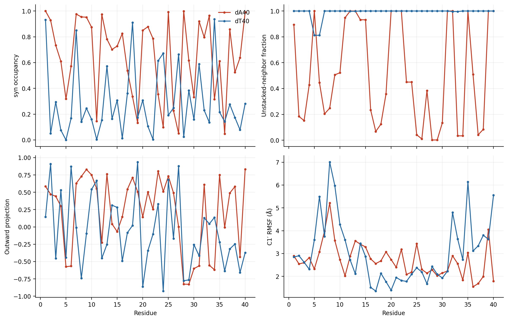
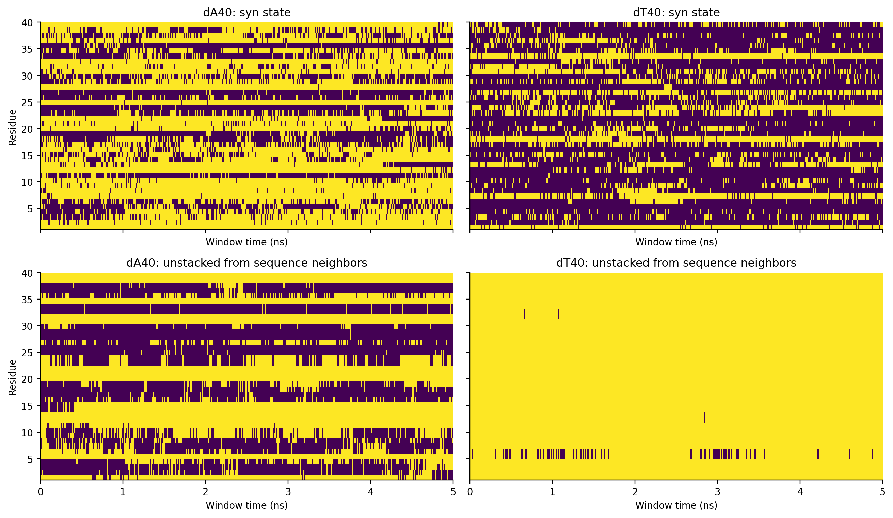
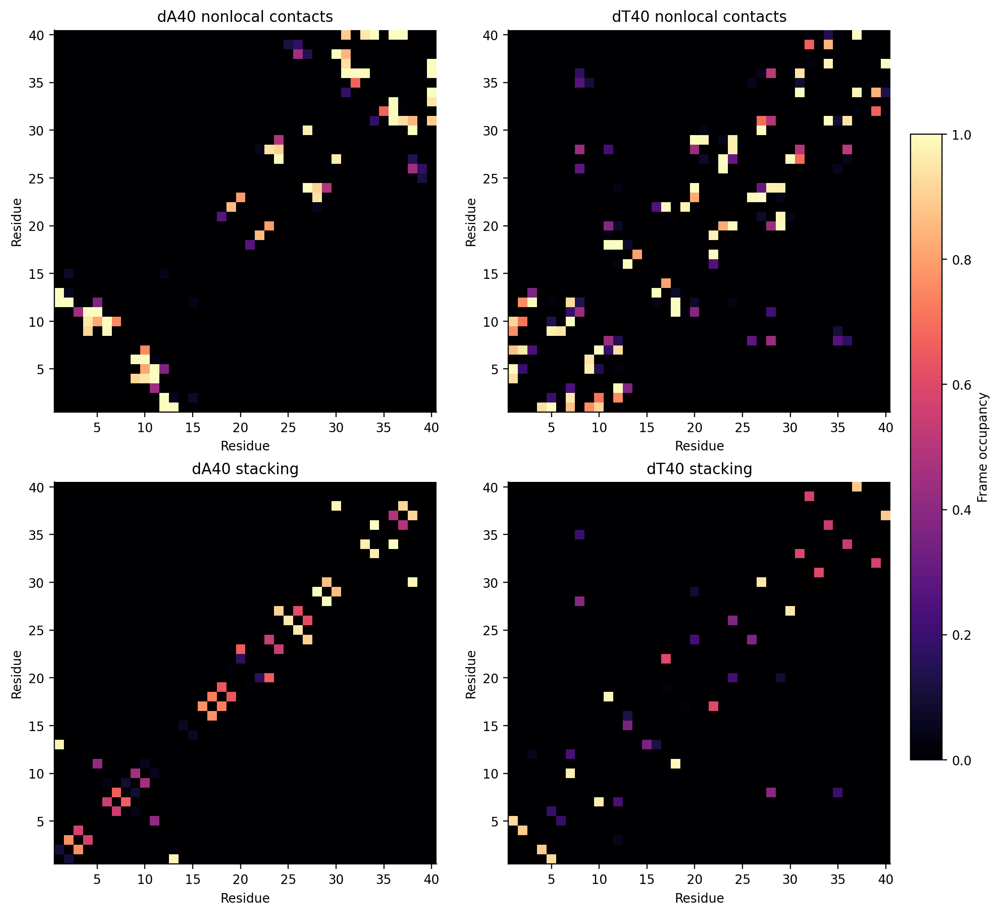
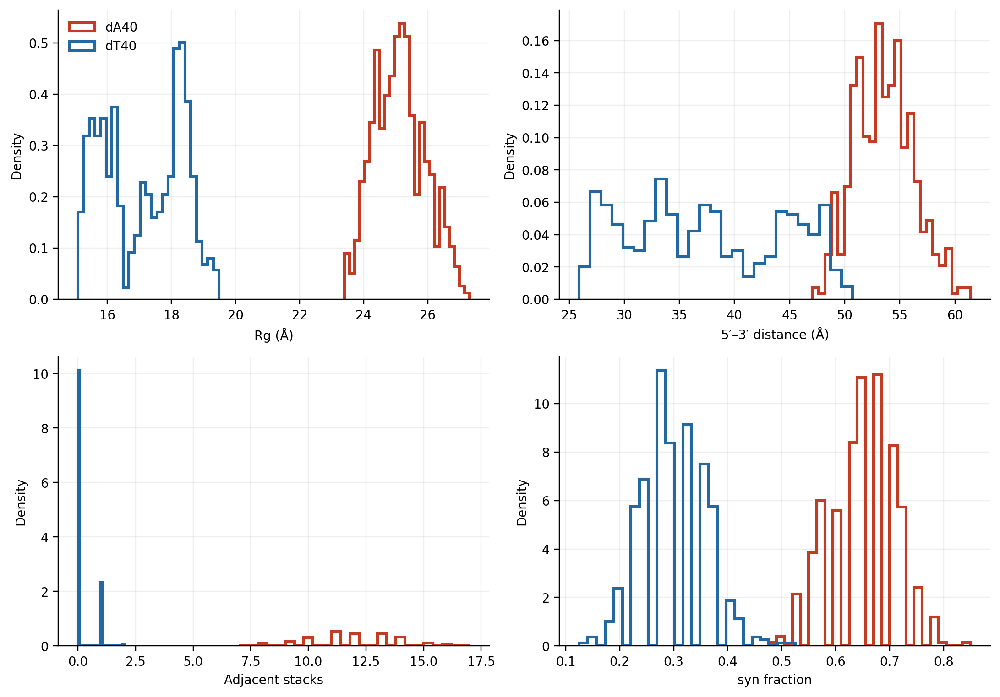
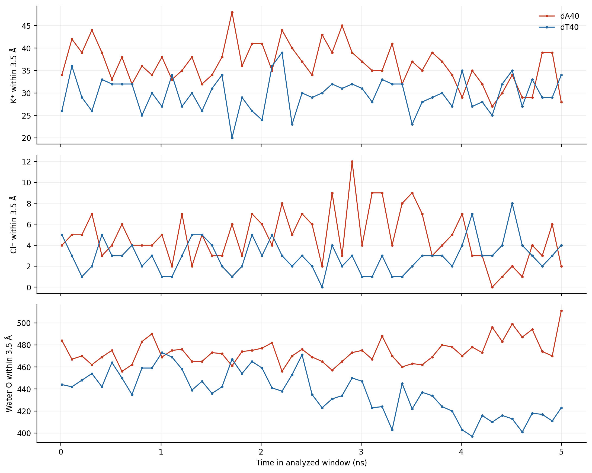
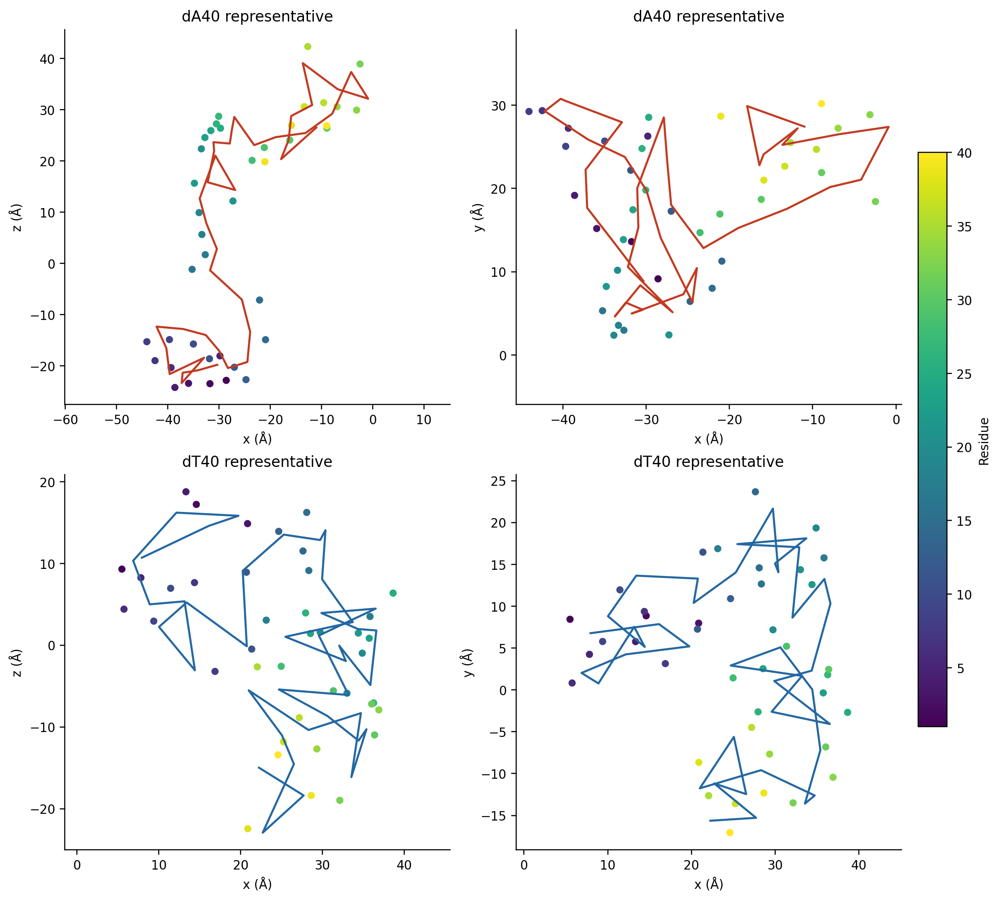

# poly(dA)40/poly(dT)40 structural analysis in 3 M KCl

Coordinates are reconstructed through PSF covalent bonds before molecular
geometry is measured. Both sequences use the matched 45.01–50.00 ns
production window: 500 frames per sequence at 10 ps intervals.

## Main result

Values are mean ± frame-to-frame standard deviation. The standard deviations
describe temporal fluctuation within one trajectory per sequence.

| Metric | dA40 | dT40 |
|---|---:|---:|
| Radius of gyration, Å | 25.13 ± 0.80 | 17.13 ± 1.23 |
| 5′–3′ C1′ distance, Å | 53.57 ± 2.66 | 37.44 ± 6.96 |
| C1′ contour length, Å | 264.90 ± 2.49 | 308.90 ± 2.99 |
| End-to-end / contour | 0.202 ± 0.010 | 0.121 ± 0.023 |
| Shape anisotropy | 0.537 ± 0.034 | 0.235 ± 0.047 |
| Adjacent stacked pairs | 11.84 ± 1.83 | 0.19 ± 0.41 |
| Unstacked-neighbor fraction | 0.509 ± 0.064 | 0.990 ± 0.020 |
| syn fraction | 0.648 ± 0.061 | 0.300 ± 0.061 |
| Mean outward-base projection | 0.221 ± 0.039 | -0.067 ± 0.028 |
| Nonlocal residue contacts | 30.19 ± 1.80 | 38.96 ± 4.12 |
| Base–base hydrogen bonds | 3.89 ± 1.34 | 0.82 ± 0.69 |
| K⁺ within 3.5 Å of DNA | 36.35 ± 4.57 | 29.76 ± 3.80 |
| Water O within 3.5 Å of DNA | 473.73 ± 11.29 | 436.98 ± 19.91 |

In this mature matched window, dA40 has an Rg 46.7%
larger than dT40. dA40 retains
61.0 times as many adjacent stacked pairs. Global compaction,
nonlocal contacts, stacking, syn occupancy and outward-base projection are
reported separately because no single observable alone defines base flipping.

## Definitions

- Rg is mass-weighted over DNA heavy atoms.
- Strict stacking requires centroid distance ≤5.5 Å, plane-normal alignment
  within 45°, normal separation 2.0–4.5 Å and lateral displacement ≤3.5 Å.
- syn is `|χ| < 90°`, using O4′–C1′–N9–C4 for A and
  O4′–C1′–N1–C2 for T.
- Outward projection is the C1′→base-centroid direction projected onto the
  molecular-center→C1′ direction.
- Nonlocal contacts use a 4.5 Å heavy-atom cutoff and sequence separation ≥3.
- Ion and water contacts use periodic distances and a 3.5 Å cutoff.

The largest reconstructed DNA bonds are
1.707 Å for dA40 and
1.702 Å for dT40. Exact input hashes,
selected frames and representative-frame times are recorded in
[`validation.json`](validation.json).
