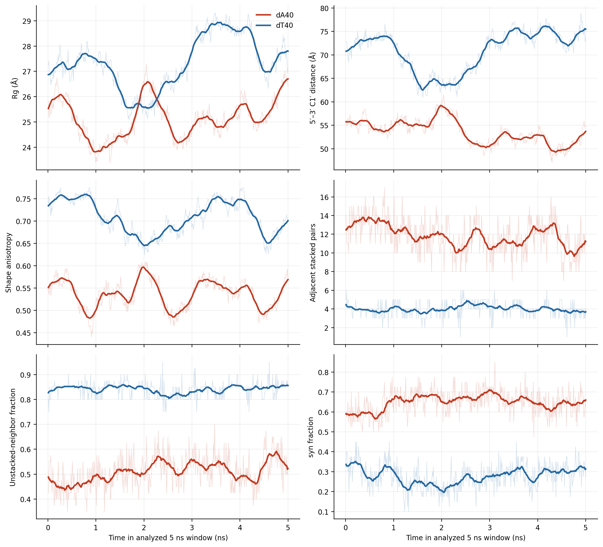
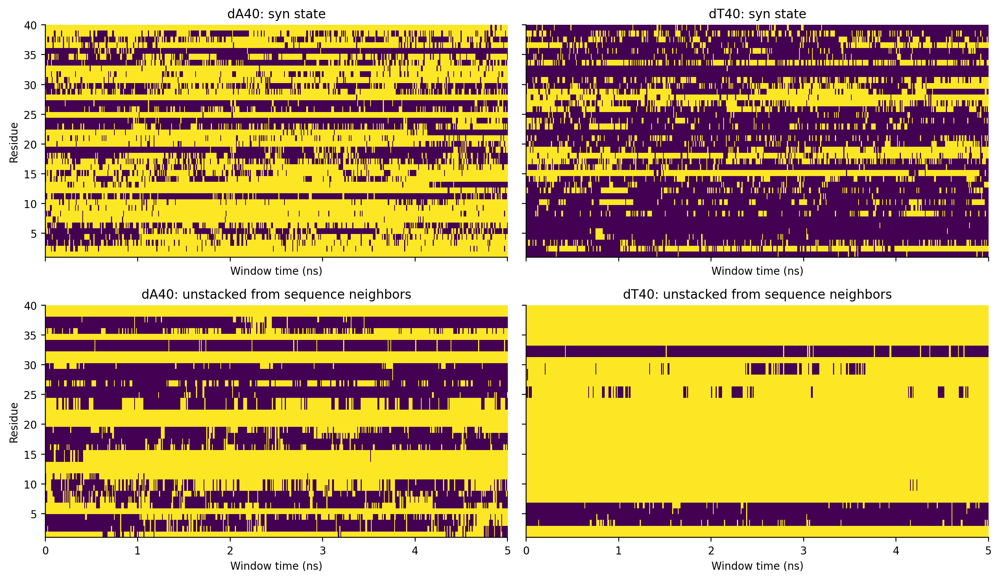

# poly(dT)40 results

`validation/` contains all stage endpoint checks, the 500-frame production
geometry trace and the consolidated all-frame summary for the retained 5 ns
image-safe dT production.

The 3.16 GB production DCD is omitted from Git and recorded in
[`data-manifest/polydt40_dcd.sha256`](../../../data-manifest/polydt40_dcd.sha256).
Current validated comparison figures and tables are in
[`../../comparison/results/2026-09-21/`](../../comparison/results/2026-09-21/README.md).

## Analysis figure preview

These figures contain the dT40 curves and residue-level measurements alongside
the matched dA40 window. Open the
[`complete seven-figure gallery`](../../comparison/results/2026-09-21/README.md)
for contact maps, distributions, ion/hydration contacts and representative
structures, with downloadable PNG and PDF files.

