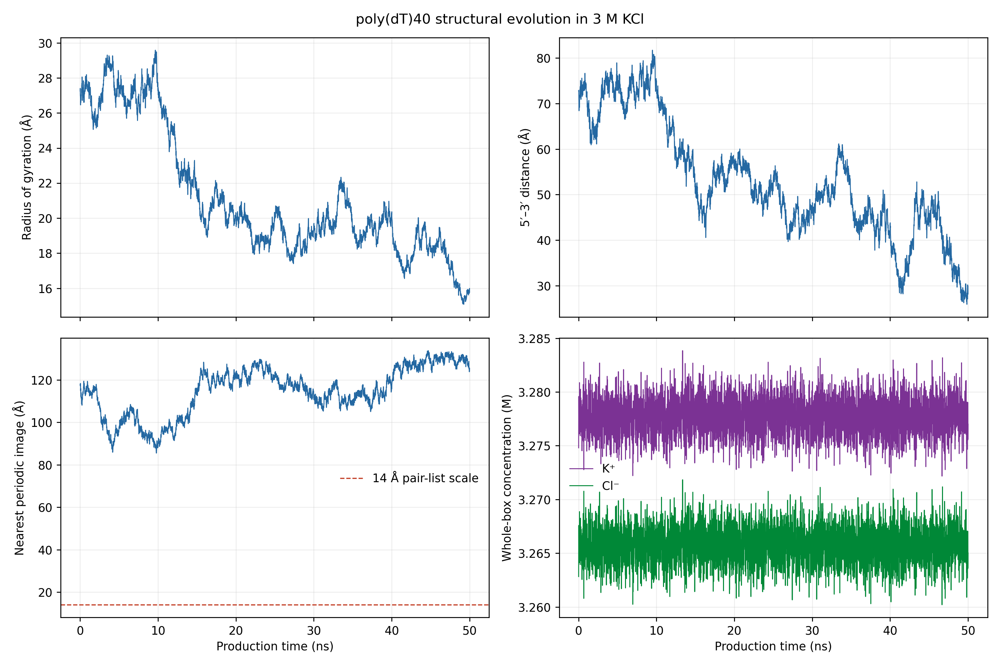

# poly(dT)40 results

The production trajectory contains 50.00 ns and 5,000 frames at 10 ps
intervals. [`validation/production_50ns_metrics.csv`](validation/production_50ns_metrics.csv)
contains the complete geometry trace; `five_ns_block_summary.csv` contains
5 ns block statistics.

The 45.01–50.00 ns mean Rg is 17.13 Å and the mean 5′–3′
distance is 37.44 Å. The final-frame values are
15.77 Å and 28.16 Å. The minimum
DNA periodic-image separation over 50 ns is
85.49 Å.

[`representative_45_50ns.pdb`](representative_45_50ns.pdb) is a real sampled
representative structure from the late window. The full dA40/dT40 figures,
tables and PyMOL display are in
[`../../comparison/results/`](../../comparison/results/README.md).

Large DCD files are omitted from Git; sizes and SHA-256 hashes are recorded in
[`../../../data-manifest/polydt40_dcd.sha256`](../../../data-manifest/polydt40_dcd.sha256).
